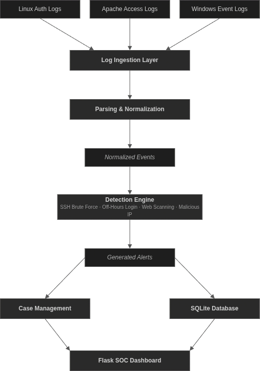

# SIEM Platform

A Python-based Security Information and Event Management (SIEM) platform built with Python and Flask that simulates a modern Security Operations Center (SOC) workflow. The platform ingests Linux, Apache, and Windows logs, normalizes them into a unified event model, executes automated detection rules, enriches indicators with threat intelligence, and provides a web-based interface for alert triage, case management, and analyst investigations.

## Table of Contents

- [Highlights](#highlights)
- [Overview](#overview)
- [Architecture](#architecture)
- [Screenshots](#screenshots)
- [Features](#features)
- [Project Structure](#project-structure)
- [Database Schema](#database-schema)
- [Setup](#setup)
- [Usage](#usage)
- [Dashboard Routes](#dashboard-routes)
- [Tech Stack](#tech-stack)

## Highlights

* End-to-end SOC workflow: **logs → events → detections → alerts → investigations → cases**
* Multi-source log ingestion for Linux authentication, Apache access, and Windows Event Logs
* Four detection rules mapped to the MITRE ATT&CK framework with AbuseIPDB threat intelligence enrichment
* SOC-style alert lifecycle with severity levels, status tracking, and linked evidence
* Case management with investigation notes, analyst verdicts, and case status updates
* Interactive Flask dashboard for monitoring events, alerts, investigations, and search
* Synthetic log generation for creating realistic attack scenarios without external tooling
* Fully local deployment using Python, Flask, and SQLite with no cloud dependencies


## Overview

SIEM Platform simulates a real SOC workflow:

```
Logs → Ingest → Parse → Normalize → Detect → Alert → Triage → Case → Verdict
```

Three log sources feed into a unified event store. Detection modules run against the events and generate structured alerts with MITRE ATT&CK mappings. Analysts can triage alerts, open cases, add investigation notes, and record verdicts — all from the web UI.

## Architecture

The SIEM processes logs through a multi-stage pipeline. Raw logs are ingested, parsed into a normalized event format, evaluated by detection rules, and stored as alerts in SQLite. Analysts investigate alerts through the Flask dashboard, where they can create cases, add notes, update statuses, and assign verdicts.



## Screenshots

The following screenshots demonstrate the analyst workflow, including dashboard monitoring, alert triage, case management, and investigation.

### Dashboard


### Alerts


### Alert Investigation


### Case Investigation


### Cases


### Events


## Features

### Log Ingestion & Parsing
- **Linux auth logs** — SSH accepted/failed password events via regex
- **Apache access logs** — combined log format, web request parsing
- **Windows Event Logs** — JSON/winlog format, Event IDs 4624, 4625, 4720, 4726, 4732

### Threat Detection
| Rule | Log Source | MITRE ATT&CK | Trigger |
|---|---|---|---|
| SSH Brute Force | auth.log | T1110 | ≥5 failed logins from same source IP |
| Off-Hours Login | auth.log | T1078 | Successful login outside 08:00–18:00; HIGH if admin/root |
| Web Scanning / Recon | apache.log | T1595 | ≥3 hits on sensitive paths or ≥10 unique paths probed |
| Malicious IP | all sources | Threat Intel | AbuseIPDB confidence score ≥75 |

### Alert Management
- Alerts with severity (`LOW` / `MEDIUM` / `HIGH` / `CRITICAL`) and status (`NEW` / `INVESTIGATING` / `ESCALATED` / `CLOSED`)
- Each alert maintains links to the normalized events that triggered the detection, enabling analysts to pivot from alerts to supporting evidence during investigations.
- Status lifecycle management via `alert_manager`

### Case Management & Investigation
- Open cases from alerts
- Add timestamped investigation notes
- Set verdicts: `TRUE POSITIVE` / `FALSE POSITIVE` / `BENIGN`
- Case status tracking independent of alert status

### Web Dashboard
- Security overview — alert counts by status, top source IPs, unique IP count
- Full event browser with drill-down to raw log fields
- Alert list with severity badges and MITRE IDs
- Case list with verdict status
- IP and title search across all alerts

### Threat Intelligence
- AbuseIPDB integration for public IP reputation checks
- Private IP filtering (only public IPs are checked)

### Synthetic Log Generators
- Generates realistic Linux auth, Apache access, and Windows Event logs containing both benign and malicious activity for repeatable testing.

## Project Structure

```
siem-platform/
├── app.py                        # Flask app and all routes
├── requirements.txt
├── logs/
│   ├── auth.log
│   ├── apache.log
│   └── windows.log
├── generators/                   # Synthetic log generators for testing
│   ├── auth_generator.py
│   ├── apache_generator.py
│   └── windows_generator.py
├── src/
│   ├── pipeline.py               # Orchestrates ingest → parse → detect → store
│   ├── ingestion/
│   │   └── ingest_log.py         # Reads raw log files
│   ├── parsers/
│   │   ├── auth_parser.py        # Linux auth log parser
│   │   ├── apache_parser.py      # Apache combined log parser
│   │   └── windows_parser.py     # Windows Event Log (JSON) parser
│   ├── detections/
│   │   ├── bruteforce.py         # T1110 — SSH brute force
│   │   ├── offhours.py           # T1078 — off-hours login
│   │   ├── webscan.py            # T1595 — web recon/scanning
│   │   └── malicious_ip.py       # AbuseIPDB IP reputation check
│   ├── alerts/
│   │   └── alert_manager.py      # Alert status lifecycle
│   ├── investigation/
│   │   ├── cases.py              # Open/close cases
│   │   ├── notes.py              # Add investigation notes
│   │   └── verdicts.py           # Set TP/FP/Benign verdict
│   ├── threat_intel/
│   │   └── abuseipdb.py
│   ├── database/
│   │   └── database.py           # SQLite schema + all DB operations
│   └── mitre/
│       └── mappings.py
├── templates/                    # Jinja2 HTML templates
│   ├── dashboard.html
│   ├── events.html
│   ├── event_details.html
│   ├── alerts.html
│   ├── alert_details.html
│   ├── cases.html
│   ├── case_details.html
│   └── search.html
├── static/
│   └── style.css                 # Dark terminal-style UI
└── data/
    └── alerts.db                 # SQLite database
```

## Database Schema

| Table | Description |
|-------|-------------|
| events | Normalized events from all log sources |
| alerts | Generated detections with severity, status, and MITRE mappings |
| alert_events | Mapping between alerts and the events that triggered them |
| cases | Investigation cases created by analysts |
| notes | Timestamped analyst investigation notes |

## Setup

```bash
git clone https://github.com/yugg755i/siem-platform
cd siem-platform

python -m venv .venv
source .venv/bin/activate

pip install -r requirements.txt
```

**AbuseIPDB (optional):**

Create a `.env` file in the project root:
```
ABUSEIPDB_API_KEY=your_key_here
```

## Usage

- Start the application.

```bash

python app.py

```

- Open `http://127.0.0.1:5000` in your browser.

- Use **Generate Sample Logs** to create realistic log data. The application automatically generates logs, normalizes them into events, executes detection rules, and creates alerts.

- Alternatively, use **Upload Logs** to import your own Linux authentication, Apache access, or Windows Event Logs.

- Use **Process Logs** to parse uploaded logs into normalized events.

- Use **Run Detections** to execute all detection rules against the event database and generate alerts.
  
- Investigate alerts through the dashboard, create investigation cases, record analyst notes, update statuses, and assign verdicts.

- Use **Clear All** to reset the database and start a new investigation dataset.

## Dashboard Routes

| Route | Description |
|---|---|
| `/` | Security overview — KPIs, top IPs, recent events |
| `/events` | All normalized events across log sources |
| `/events/<id>` | Raw field dump for a single event |
| `/alerts` | All alerts — severity, MITRE ID, status |
| `/alerts/<id>` | Alert detail with linked events and cases |
| `/cases` | All investigation cases with verdict status |
| `/cases/<id>` | Case detail with notes and verdict |
| `/search` | Search alerts by source IP or title |

## Tech Stack

- Python 3.10+
- Flask
- SQLite3
- Jinja2
- HTML5
- CSS3
- requests
- python-dotenv
