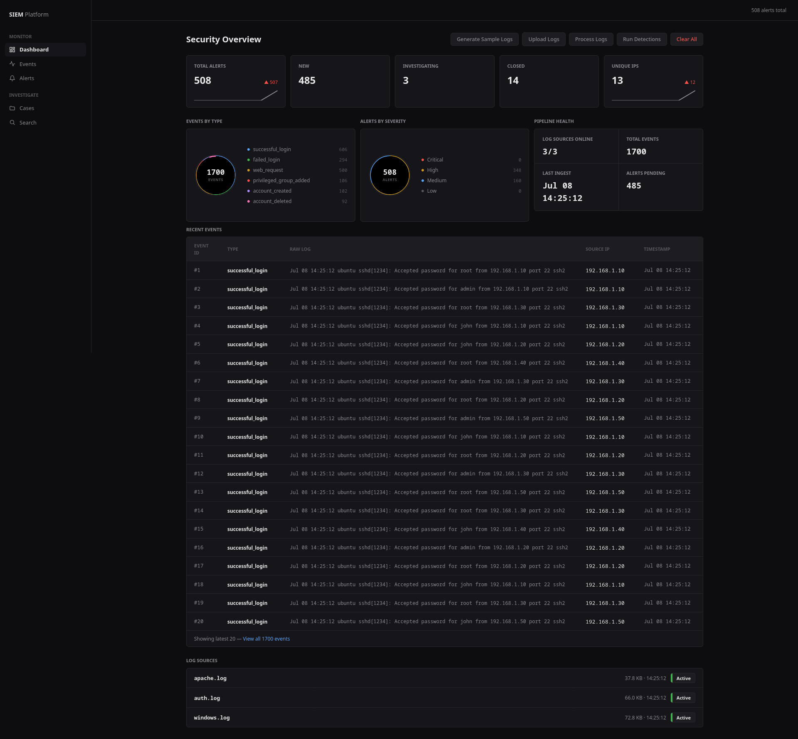
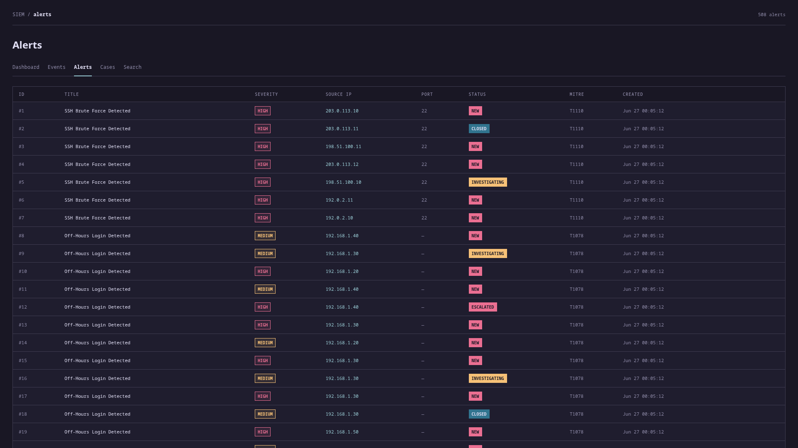
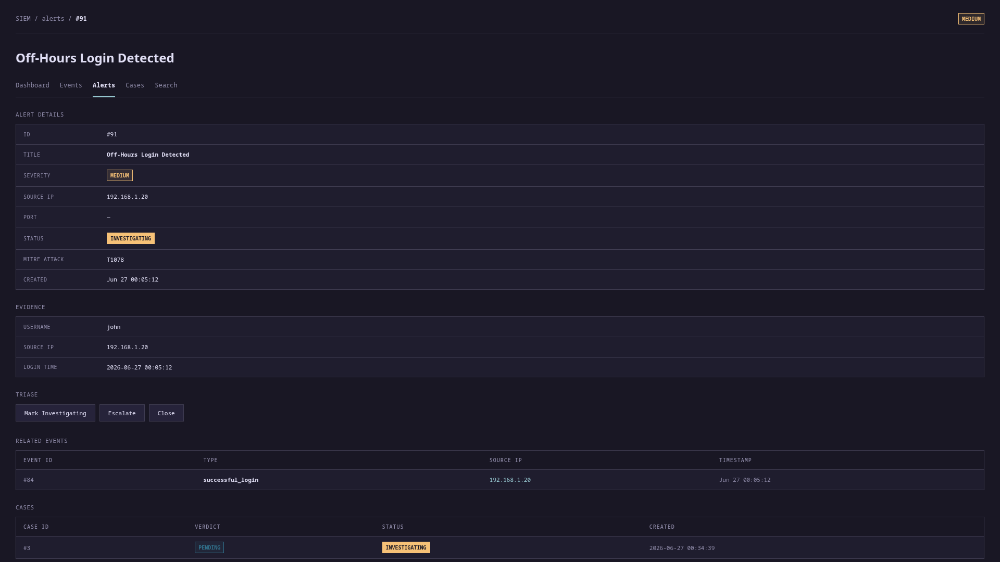
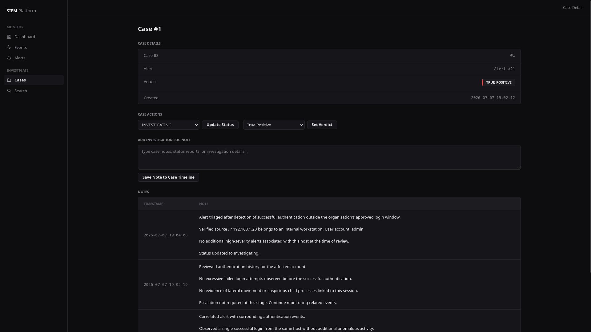
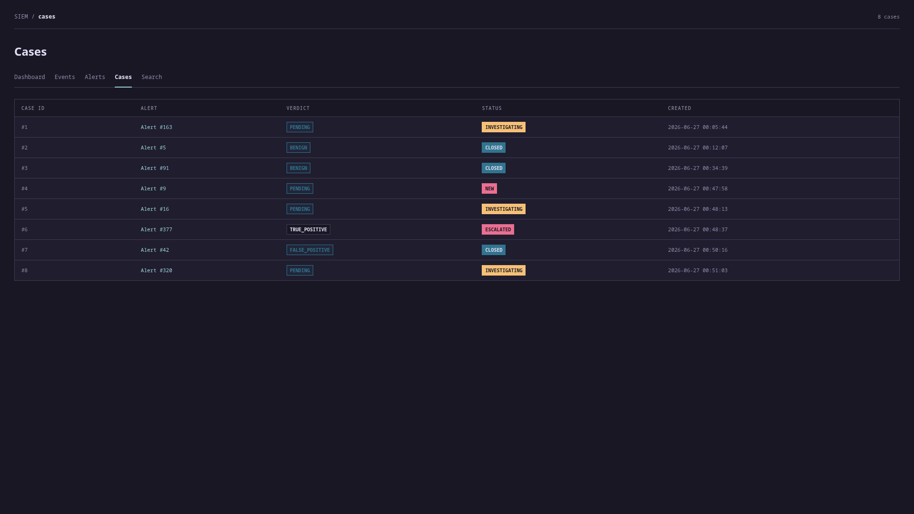
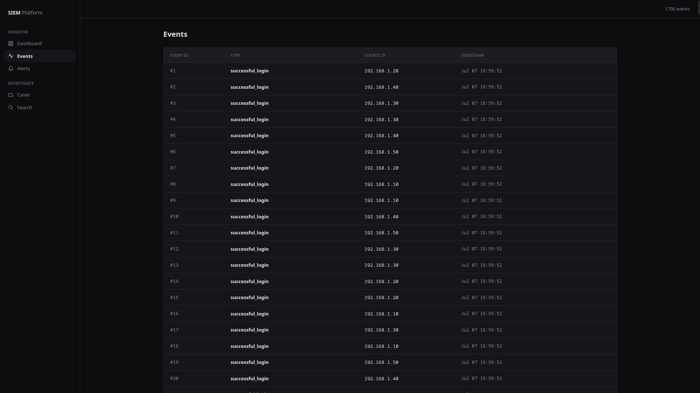

# SIEM Platform

A lightweight Security Information and Event Management (SIEM) system built with Python and Flask. Ingests logs from multiple sources, normalizes them into events, runs automated threat detection rules, and presents everything through a SOC-style web dashboard with alert triage, case management, and investigation workflows.

## Table of Contents

- [Highlights](#highlights)
- [Overview](#overview)
- [Screenshots](#screenshots)
- [Features](#features)
- [Project Structure](#project-structure)
- [Database Schema](#database-schema)
- [Setup](#setup)
- [Usage](#usage)
- [Dashboard Routes](#dashboard-routes)
- [Tech Stack](#tech-stack)

## Highlights

- End-to-end SOC workflow from raw logs to case verdict — all in one local tool
- 4 detection rules with MITRE ATT&CK mappings and AbuseIPDB threat intelligence enrichment
- Full case management: open cases, add investigation notes, set TP/FP/Benign verdicts
- Synthetic log generators for testing attack scenarios without external tooling
- AbuseIPDB threat intel integration for live IP reputation checks
- Zero cloud dependency — runs entirely local on SQLite + Flask

## Overview

SIEM Platform simulates a real SOC workflow:

```
Logs → Ingest → Parse → Normalize → Detect → Alert → Triage → Case → Verdict
```

Three log sources feed into a unified event store. Detection modules run against the events and generate structured alerts with MITRE ATT&CK mappings. Analysts can triage alerts, open cases, add investigation notes, and record verdicts — all from the web UI.

## Screenshots

### Dashboard


### Alerts


### Alert Investigation


### Case Investigation


### Cases


### Events


## Features

### Log Ingestion & Parsing
- **Linux auth logs** — SSH accepted/failed password events via regex
- **Apache access logs** — combined log format, web request parsing
- **Windows Event Logs** — JSON/winlog format, Event IDs 4624, 4625, 4720, 4726, 4732

### Threat Detection
| Rule | Log Source | MITRE ATT&CK | Trigger |
|---|---|---|---|
| SSH Brute Force | auth.log | T1110 | ≥5 failed logins from same source IP |
| Off-Hours Login | auth.log | T1078 | Successful login outside 08:00–18:00; HIGH if admin/root |
| Web Scanning / Recon | apache.log | T1595 | ≥3 hits on sensitive paths or ≥10 unique paths probed |
| Malicious IP | all sources | Threat Intel | AbuseIPDB confidence score ≥75 |

### Alert Management
- Alerts with severity (`LOW` / `MEDIUM` / `HIGH` / `CRITICAL`) and status (`NEW` / `INVESTIGATING` / `ESCALATED` / `CLOSED`)
- Each alert maintains links to the normalized events that triggered the detection, enabling analysts to pivot from alerts to supporting evidence during investigations.
- Status lifecycle management via `alert_manager`

### Case Management & Investigation
- Open cases from alerts
- Add timestamped investigation notes
- Set verdicts: `TRUE POSITIVE` / `FALSE POSITIVE` / `BENIGN`
- Case status tracking independent of alert status

### Web Dashboard
- Security overview — alert counts by status, top source IPs, unique IP count
- Full event browser with drill-down to raw log fields
- Alert list with severity badges and MITRE IDs
- Case list with verdict status
- IP and title search across all alerts

### Threat Intelligence
- AbuseIPDB integration for public IP reputation checks
- Private IP filtering (only public IPs are checked)

### Synthetic Log Generators
- Generates realistic auth, Apache, and Windows logs with both normal and attack traffic for testing

## Project Structure

```
siem-platform/
├── app.py                        # Flask app and all routes
├── requirements.txt
├── logs/
│   ├── auth.log
│   ├── apache.log
│   └── windows.log
├── generators/                   # Synthetic log generators for testing
│   ├── auth_generator.py
│   ├── apache_generator.py
│   └── windows_generator.py
├── src/
│   ├── pipeline.py               # Orchestrates ingest → parse → detect → store
│   ├── ingestion/
│   │   └── ingest_log.py         # Reads raw log files
│   ├── parsers/
│   │   ├── auth_parser.py        # Linux auth log parser
│   │   ├── apache_parser.py      # Apache combined log parser
│   │   └── windows_parser.py     # Windows Event Log (JSON) parser
│   ├── detections/
│   │   ├── bruteforce.py         # T1110 — SSH brute force
│   │   ├── offhours.py           # T1078 — off-hours login
│   │   ├── webscan.py            # T1595 — web recon/scanning
│   │   └── malicious_ip.py       # AbuseIPDB IP reputation check
│   ├── alerts/
│   │   └── alert_manager.py      # Alert status lifecycle
│   ├── investigation/
│   │   ├── cases.py              # Open/close cases
│   │   ├── notes.py              # Add investigation notes
│   │   └── verdicts.py           # Set TP/FP/Benign verdict
│   ├── threat_intel/
│   │   └── abuseipdb.py
│   ├── database/
│   │   └── database.py           # SQLite schema + all DB operations
│   └── mitre/
│       └── mappings.py
├── templates/                    # Jinja2 HTML templates
│   ├── dashboard.html
│   ├── events.html
│   ├── event_details.html
│   ├── alerts.html
│   ├── alert_details.html
│   ├── cases.html
│   ├── case_details.html
│   └── search.html
├── static/
│   └── style.css                 # Dark terminal-style UI
└── data/
    └── alerts.db                 # SQLite database
```

## Database Schema

```
events          — normalized log events from all sources
alerts          — detections with severity, status, MITRE ID
alert_events    — many-to-many: alerts ↔ events
cases           — investigation cases linked to alerts
notes           — timestamped analyst notes on cases
```

## Setup

```bash
git clone https://github.com/yugg755i/siem-platform
cd siem-platform

python -m venv .venv
source .venv/bin/activate

pip install -r requirements.txt
```

**AbuseIPDB (optional):**

Create a `.env` file in the project root:
```
ABUSEIPDB_API_KEY=your_key_here
```

## Usage

- Start the application:

```bash
python app.py
```

- Open http://127.0.0.1:5000.
- Click Generate Sample Logs to create synthetic log data, it would automatically generate logs, events and alerts.
- Click Upload Logs to import your own auth, Apache, or Windows logs
- Click Process Logs to ingest, parse, and normalize events.
- Click Run Detections to execute detection rules and generate alerts.
- Investigate alerts, create cases, add analyst notes, and assign verdicts through the web dashboard.
- Use Clear All to reset the database.

## Dashboard Routes

| Route | Description |
|---|---|
| `/` | Security overview — KPIs, top IPs, recent events |
| `/events` | All normalized events across log sources |
| `/events/<id>` | Raw field dump for a single event |
| `/alerts` | All alerts — severity, MITRE ID, status |
| `/alerts/<id>` | Alert detail with linked events and cases |
| `/cases` | All investigation cases with verdict status |
| `/cases/<id>` | Case detail with notes and verdict |
| `/search` | Search alerts by source IP or title |

## Tech Stack

- Python 3.10+
- Flask
- SQLite3
- HTML5
- CSS3
- Jinja2
- python-dotenv
- requests
